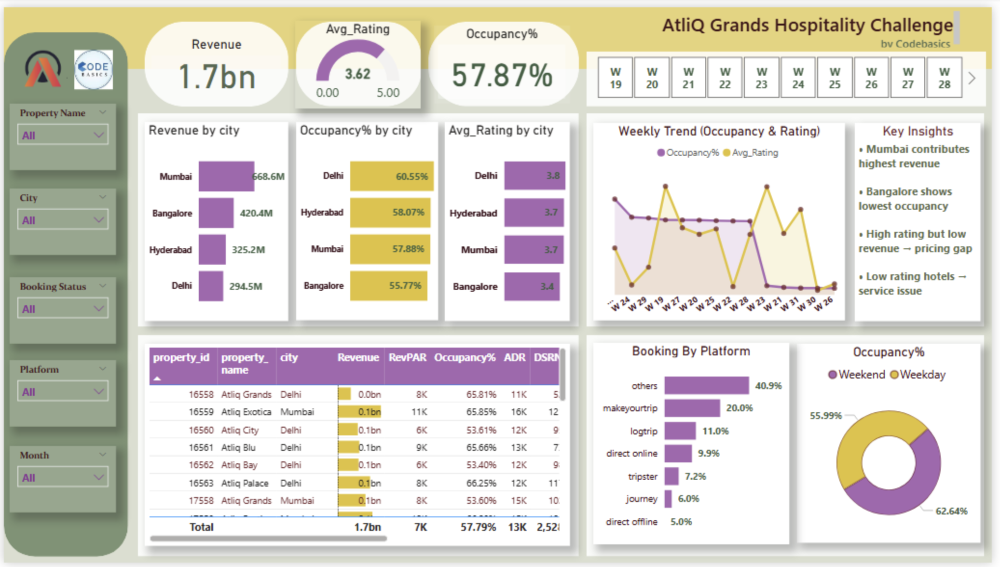
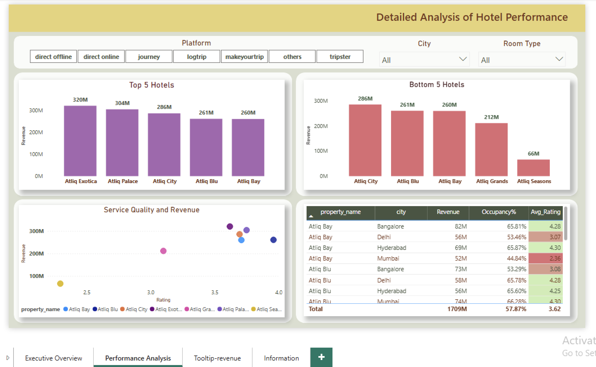
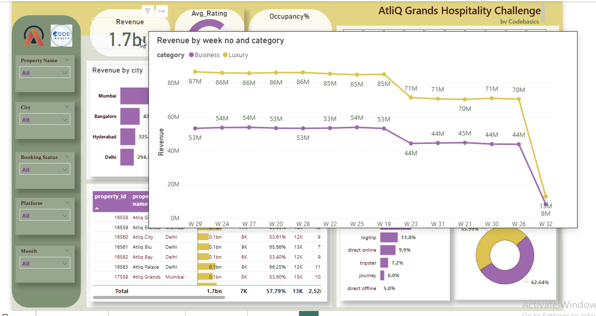

# Hospitality Revenue Analytics Dashboard (Power BI)

---

## 📌 Overview
This project analyzes hotel performance to uncover revenue trends, occupancy patterns, and operational inefficiencies. The dashboard enables stakeholders to monitor key metrics and make data-driven decisions.

---

## ❗ Business Problem
AtliQ Grands, a luxury hotel chain, is facing declining market share and revenue due to increased competition and ineffective decision-making.

The objective is to:
- Identify revenue leakage  
- Improve occupancy rates  
- Optimize pricing and performance  

### 🎯 Task
- Create KPIs using DAX based on the metric list  
- Build a dashboard based on stakeholder mock-up  
- Generate actionable business insights  

---

## 📊 Dataset
The dataset includes hotel booking and operational data:

- fact_bookings  
- fact_aggregated_bookings  
- dim_date  
- dim_hotels  
- dim_rooms  

These datasets contain booking details, revenue, room capacity, customer ratings, and booking platforms.

---

## 🛠️ Tools & Technologies
- Power BI  
- DAX (Data Analysis Expressions)  
- Data Modeling (Star Schema)  

---

## 📂 Project Structure
## 📂 Project Structure

```
hospitality-revenue-analysis-powerbi/
 ┣ data/
 ┃ ┣ raw/
 ┃ ┃ ┣ fact_bookings.csv
 ┃ ┃ ┣ fact_aggregated_bookings.csv
 ┃ ┃ ┣ dim_date.csv
 ┃ ┃ ┣ dim_hotels.csv
 ┃ ┃ ┗ dim_rooms.csv
 ┃ ┣ metadata_hospitality.txt
 ┃ ┗ metrics_list.xlsx
 ┣ docs/
 ┃ ┣ problem_statement.pdf
 ┃ ┗ powerbi_dive_guide.pdf
 ┣ dashboard/
 ┃ ┗ hotel_dashboard.pbit
 ┣ images/
 ┃ ┣ Executive_Overview.png
 ┃ ┣ Performance_Analysis.png
 ┃ ┣ Tooltip_revenue.png
 ┃ ┗ mockup_dashboard.png
 ┗ README.md
```

---

## 🔍 Research Questions & Key Findings

### Key Questions:
- Which cities generate the highest revenue?  
- Which properties are underperforming?  
- Is there a relationship between rating and revenue?  
- Where are pricing or service gaps?  

### Key Findings:
- Mumbai generates the highest revenue  
- Bangalore shows lower occupancy rates  
- High rating but low revenue indicates pricing inefficiency  
- Low rating properties correlate with lower revenue (service issue)  

---

## 📈 Dashboard

### Executive Overview
- KPI Cards: Revenue, Occupancy %, Average Rating  
- Revenue & Occupancy by City  
- Weekly Trends  
- Booking Platform Analysis  
- Weekend vs Weekday performance  

### Performance Analysis
- Top 5 & Bottom 5 Hotels  
- Revenue vs Rating (Scatter Plot)  
- Property-level Table  
- Filters (City, Room Type, Platform)  

---

## 📸 Dashboard Preview

### Executive Overview


### Performance Analysis


### Tooltip View


### Mockup


---

## ▶️ How to Use
1. Download the `.pbit` file from the `dashboard` folder  
2. Open in Power BI Desktop  
3. Connect to the dataset if required  
4. Explore dashboards and use filters for analysis  

---

## 💡 Final Recommendations
- Improve pricing strategy for high-rated but low-revenue properties  
- Enhance service quality in low-rated hotels  
- Focus on increasing occupancy in underperforming cities  
- Optimize booking platform strategy  

---

## 👩‍💻 Author & Contact
Prianka Mondal  
Aspiring Data Analyst  

🔗 LinkedIn: https://www.linkedin.com/in/priankamondal/  
🔗 GitHub: https://github.com/priankamondalwork-png